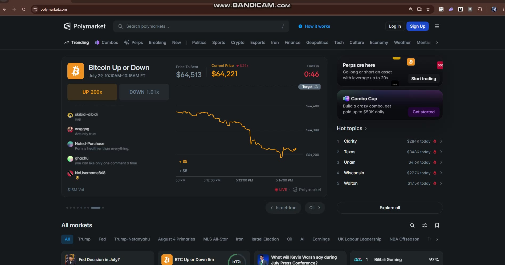
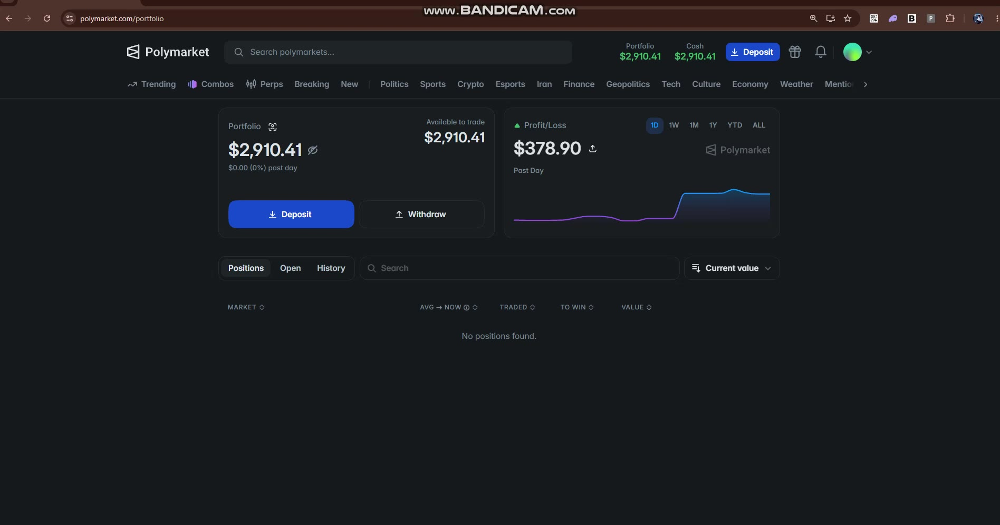
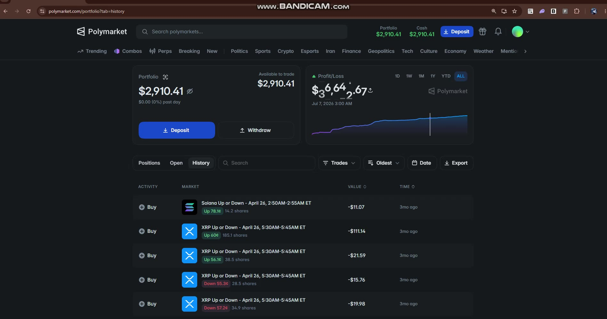

# Polymarket Endcycle Sniper Bot

**Focus strategy:** an **AI predictive model** forecasts the winning side **4–5 seconds before** each crypto **Up/Down** market closes, then the bot buys that outcome and redeems at **$1**.

Also includes a mid-market **arbitrage** mode (buy both sides → merge). This repo’s primary product is the **endcycle sniper**.

**🌐 Language:** [English](README.md) | [中文](README.zh-CN.md) | [Français](README.fr.md) | [Español](README.es.md)

---

## Profile

| | |
|--|--|
| **Telegram** | [`@dizzy`](https://t.me/dizzy) |
| **Polymarket** | [`@uord`](https://polymarket.com/@uord) |
| **Wallet** | [`0x0a6c99d88523d328f6a8edf7db851796dc7f7e41`](https://polymarket.com/profile/0x0a6c99d88523d328f6a8edf7db851796dc7f7e41) |

---

## Demo video — Endcycle Sniper

📹 **[Watch endcycle demo]

https://github.com/user-attachments/assets/010589be-d923-40ee-959c-7d7bfc2dee5e

What the recording shows:

1. Live **Bitcoin Up or Down** 5-minute window approaching close  
2. **Price to beat** vs **current BTC** on the market card  
3. Wallet connect / sign as **`@uord`**  
4. Portfolio, P/L curve, withdrawals, and Up/Down trade history across assets  

| Late-cycle market | Portfolio (demo) |
|-------------------|------------------|
|  |  |

---

## Results (`@dizzydev` — from demo)

| Metric | Value |
|--------|------:|
| Portfolio / cash | **$2,910.41** |
| Past day P/L | **+$378.90** |
| 1-week P/L | **+$562.55** |
| All-time P/L | **+$3,664.67** |



---

## Strategies overview

| Strategy | Idea | Role |
|----------|------|------|
| **Endcycle Sniper** (focus) | AI model predicts UP/DOWN **4–5s before close**, then buy the predicted side | Primary — demo video |
| **Arbitrage** | Buy UP + DOWN mid-market, merge to USDC | Secondary |
| **$0.01 liquidity** | Catch thin books when winners print near 1¢ | Optional |

---

## Endcycle Sniper (detailed)

### Idea

Polymarket runs rolling **N-minute** crypto markets (often **5m**):

- **Strike / price to beat** = reference price at interval **start**  
- **UP** wins if price at **end** is **above** the strike  
- **DOWN** wins if price at **end** is **below** the strike  
- Winning shares redeem at **~$1**; losers → **$0**

The endcycle bot does **not** wait for the book to already price a near-certainty favorite for the whole last minute. Instead it runs an **AI predictive model** on live market + spot features and outputs the likely winning direction **about 4–5 seconds before the market closes**. The bot then places a fast **BUY** on that side and holds through resolution.

```
Interval (e.g. 5 minutes)
|-------------------------------------------|----|
start                                  AI fire  end
(price to beat fixed)              (~4–5s left) (resolve)
                                         │
                                         ├─ model → UP or DOWN
                                         ├─ place BUY on predicted side
                                         └─ redeem $1 if correct
```

### AI prediction window

| Step | Timing | Action |
|------|--------|--------|
| 1 | Interval open | Discover market, track strike, spot feeds, book |
| 2 | Mid-interval | Model features update continuously; **no entry** yet |
| 3 | **~4–5 seconds before close** | Model emits predicted direction (UP or DOWN) |
| 4 | Immediately after signal | Aggressive BUY on predicted token |
| 5 | After resolution | Redeem winners; roll to next interval |

The short **4–5s** lead is the core edge: early enough to get a fill before the clock hits zero, late enough that the model’s direction call is high-confidence.

### What the demo market looked like

From the video (BTC 5m approaching close):

| Field | Example |
|-------|---------|
| Market | Bitcoin Up or Down · 5-minute ET window |
| Price to beat | $64,513 |
| Current price | ~$64,221 |
| Context | Final seconds of the cycle — sniper / AI fire window |

### Entry logic

1. **Discover** the active Up/Down market for the configured asset / interval.  
2. **Stream** spot (Coinbase / Binance / Chainlink), CLOB book, and time-to-close into the model.  
3. **Idle** until the prediction window (~**4–5 seconds** before end).  
4. **AI model** predicts **UP** or **DOWN**.  
5. **Fire** BUY on the predicted side (limit up to `BUY_LIMIT_PRICE`, size `ORDER_SIZE`).  
6. **Redeem** after resolution (relayer); repeat next interval.  

Skip or size down if the book has no liquidity, latency is too high, or paper mode is on.

### Why edge exists (and when it doesn’t)

| Works when | Fails when |
|------------|------------|
| Model direction matches resolution | Last-tick reversal vs the prediction |
| Order fills in the 4–5s window | Latency / reject — miss the close |
| Ask still below $1 after fees | Book already fully priced / no size |
| Feed features align with resolution oracle | Feature feed disagrees with Polymarket settle source |

Sniping is **many small cycles** (buy predicted side → redeem $1), not one large bet.

| Buy | Shares | Cost | Claim | Approx. PnL |
|-----|-------:|-----:|------:|------------:|
| 98¢ | 68.3 | $66.95 | $68.31 | **+$1.4** |
| 98¢ | 102 | $100 | $102.03 | **+$2.03** |
| 97¢ | ~103 | $100 | $103.07 | **+$3.07** |

Pattern: **AI picks side late → buy → redeem $1**.

### Features

- **AI predictive model** — direction call **~4–5s before close**  
- End-of-cycle execution only (not full-interval market making)  
- Live spot + book features into the model  
- Aggressive BUY on the predicted side  
- Multi-asset short Up/Down markets (BTC, ETH, SOL, …)  
- Redeem / claim after resolution  

### Parameters (set in `src/config/params.py` or `.env`)

| Param | Role |
|-------|------|
| `RISK_STOP_TIME_SEC` | Endcycle / prediction timing window (align with ~4–5s fire) |
| `BUY_LIMIT_PRICE` | Max price to pay for the predicted side (e.g. 0.99) |
| `ORDER_SIZE` | Order size |
| `MARKET_INTERVAL_SECONDS` | Interval length (default 300 = 5m) |
| `ASSET` / `MARKET_SLUG_PREFIX` | Which Up/Down series to follow |

```bash
# .env — fill before live sniping
RISK_STOP_TIME=
BUY_LIMIT_PRICE=0.99
ORDER_SIZE=30
ASSET=btc
MARKET_INTERVAL_SECONDS=300
PAPER_TRADING=1
```

### How it works (checklist)

1. Find current crypto Up/Down market  
2. Feed live data into the **AI model**  
3. At **~4–5 seconds before close**, take the model’s UP/DOWN prediction  
4. BUY the predicted side  
5. Redeem after resolution; repeat  

---

## Arbitrage (mid-market)

Secondary strategy.

Buy **both** UP and DOWN when combined cost &lt; $1 (plus fees), then **merge** equal shares back to USDC. Mid-interval mispricing / inventory — not the AI endcycle path.

|  |  |  |
|--|--|--|
|  |  |  |

| Result |
|--------|
|  |

### Features

- Auto discovery of active crypto 5m markets  
- Monitor UP/DOWN balances  
- Merge equal inventory → USDC  
- Optional force-sell near close  

### How it works

1. Find current market  
2. Place / manage both sides  
3. Merge equal amounts  
4. Force-sell residual near close if needed  
5. Roll to next market  

---

## Optional: $0.01 liquidity

When the book is thin, winners can trade near **$0.01**. Separate from endcycle sniping; see `assets/result2.png`.

---

## Quick start

```bash
python3 -m venv .venv && source .venv/bin/activate
pip install -r requirements.txt
cp .env.example .env
# set PRIVATE_KEY, FUNDER, and endcycle params
python main.py
```

Config:

- Tunables: [`src/config/params.py`](src/config/params.py)  
- Runtime state: [`src/config/config.py`](src/config/config.py)  
- Env template: [`.env.example`](.env.example)  

Guides: [docs.md](docs.md) · [WORKFLOW.md](WORKFLOW.md)

---

## Links
- **Telegram:** [@dizzy](https://t.me/dizzy)
- **Polymarket profile:** [@uord](https://polymarket.com/@uord)
