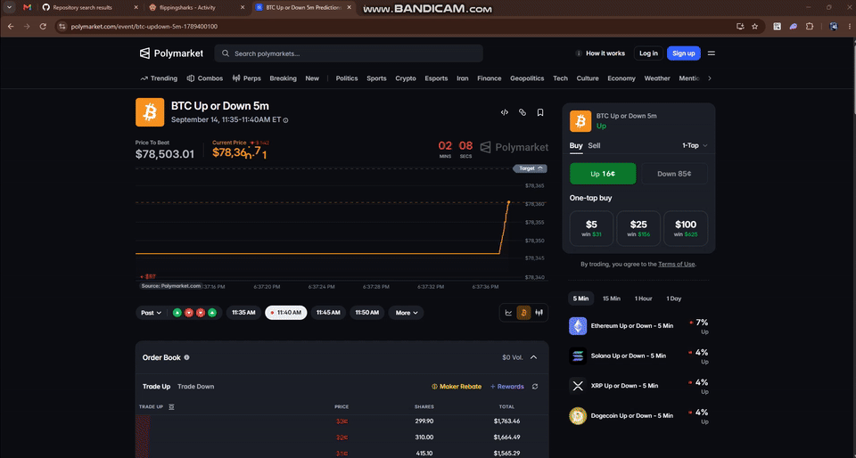

# Polymarket HFT MM 机器人

面向 Polymarket 加密货币 **Up/Down** 市场的**高频做市（HFT MM）机器人**。在整个周期内双向报价、捕获价差并轮换库存——**不受平台更新影响**（包括 Polymarket 的 TWAP 价格变更）。

**🌐 语言 / Language:** [English](README.md) | [中文](README.zh-CN.md) | [Français](README.fr.md) | [Español](README.es.md)

---

## 个人资料

| | |
|--|--|
| **Telegram** | [`@dizzy`](https://t.me/dizzy283) |
| **Polymarket** | [`@flippingsharks`](https://polymarket.com/@flippingsharks) |
| **钱包** | [`0xc387c2a40d389f17b723b6bba9b18b7dbd2de4f4`](https://polymarket.com/profile/0xc387c2a40d389f17b723b6bba9b18b7dbd2de4f4) |

---

## 演示视频

📹 **HFT MM 机器人 — 实盘演示**

下方预览会自动播放。**点击预览可打开完整视频**。

[](https://github.com/Poly-Dev05/polymarket-trading-bot/blob/main/assets/demo-video.mp4)

视频内容：

1. 机器人以 **`@flippingsharks`** 身份连接 Polymarket
2. 实时加密货币 **Up/Down** 市场（BTC 及其他资产）
3. 持续**双向报价** — 买卖盘实时更新
4. 整个周期内的订单流、成交与库存轮换
5. Polymarket 个人资料中的投资组合、盈亏与交易历史

---

## 策略

| | |
|--|--|
| **原策略** | **Endcycle Sniper（周期末狙击）** — AI 在收盘前 **4–5 秒**预测 UP/DOWN，买入预测方向，以 **$1** 赎回 |
| **变化** | Polymarket **TWAP 价格更新**后，周期末狙击**已无法稳定盈利** |
| **当前策略** | **HFT MM** — 全周期高频做市；**不受 TWAP 或其他结算变更影响** |

周期末策略依赖结算参考价在周期末的错误定价。TWAP 消除了这一优势。**HFT MM** 改为通过价差捕获和持续双向流量获利——其逻辑不依赖最终参考价的计算方式。

---

## 工作原理

Polymarket 运行滚动 **N 分钟**加密货币市场（通常为 **5 分钟**）：

- **行权价 / 基准价** = 周期**开始**时的参考价格
- **UP** 在**结束**时价格**高于**行权价则获胜
- **DOWN** 在**结束**时价格**低于**行权价则获胜
- 获胜份额以 **~$1** 赎回；失败 → **$0**

```
周期（例如 5 分钟）
|-----------------------------------------------------------|
开始                                                   结束
     │  挂 UP 买/卖单 ────┐
     │  挂 DOWN 买/卖单 ──┤  HFT MM 循环（全周期）
     │  随盘口变动刷新 ───┤
     │  轮换库存 ─────────┘
     └─ 捕获价差 → 合并 / 赎回 → 下一市场
```

### HFT MM 循环

| 步骤 | 操作 |
|------|------|
| 1 | 发现当前配置资产 / 周期的活跃 Up/Down 市场 |
| 2 | 订阅现货（Coinbase / Binance / Chainlink）与 CLOB 盘口更新 |
| 3 | 在 UP 和 DOWN 代币上挂双向报价 |
| 4 | 随价格与库存变化高频刷新报价 |
| 5 | 结算后轮换库存；进入下一周期 |

当盘口无流动性、延迟过高或开启模拟模式时，跳过或缩小规模。

### 为何 HFT MM 不受平台变更影响

| Endcycle Sniper（已弃用） | HFT MM（当前） |
|---------------------------|----------------|
| 优势来自**收盘前几秒**预测方向 | 优势来自全周期的**价差捕获** |
| TWAP 改变了最终参考价定价 | 报价逻辑**独立于结算参考价** |
| 周期末错误定价 → **无法稳定盈利** | 双向流量与库存轮换 → **不受更新影响** |

---

## 功能

- **高频做市** — 持续买卖报价，非周期末狙击
- **快速刷新订单** — 实时响应盘口与现货变动
- 现货 + CLOB 数据源用于报价定价
- 多资产 Up/Down 市场（BTC、ETH、SOL 等）
- 库存管理 — 结算后合并与赎回
- 模拟交易模式，安全测试

---

## 参数

在 [`src/config/params.py`](src/config/params.py) 或 `.env` 中设置：

| 参数 | 作用 |
|------|------|
| `ORDER_SIZE` | 报价 / 订单大小 |
| `BUY_LIMIT_PRICE` | 吃单时的最高买入价 |
| `SELL_LIMIT_PRICE` | 清仓时的最低卖出价 |
| `MIN_PLACE_INTERVAL_SEC` | 两次下单之间的最小间隔 |
| `MARKET_INTERVAL_SECONDS` | 周期长度（默认 `300` = 5 分钟） |
| `ASSET` / `MARKET_SLUG_PREFIX` | 跟踪的 Up/Down 系列 |
| `PAPER_TRADING` | `1` = 模拟，`0` = 实盘 |

```bash
# .env — 实盘前填写
PRIVATE_KEY=
FUNDER=
ORDER_SIZE=30
BUY_LIMIT_PRICE=0.99
SELL_LIMIT_PRICE=0.01
ASSET=btc
MARKET_INTERVAL_SECONDS=300
PAPER_TRADING=1
```

---

## 快速开始

```bash
python3 -m venv .venv && source .venv/bin/activate   # Windows: .venv\Scripts\activate
pip install -r requirements.txt
cp .env.example .env
# 编辑 .env — 设置 PRIVATE_KEY、FUNDER 及 HFT MM 参数
python main.py
```

**配置文件**

- 可调参数：[`src/config/params.py`](src/config/params.py)
- 运行时状态：[`src/config/config.py`](src/config/config.py)
- 环境变量模板：[`.env.example`](.env.example)

---

## 链接

- **Telegram：** [@dizzy](https://t.me/dizzy283)
- **Polymarket：** [@flippingsharks](https://polymarket.com/@flippingsharks)
- **钱包：** [0xc387c2a40d389f17b723b6bba9b18b7dbd2de4f4](https://polymarket.com/profile/0xc387c2a40d389f17b723b6bba9b18b7dbd2de4f4)
